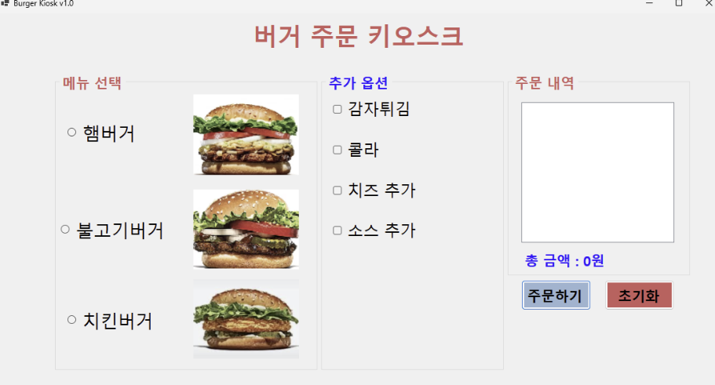
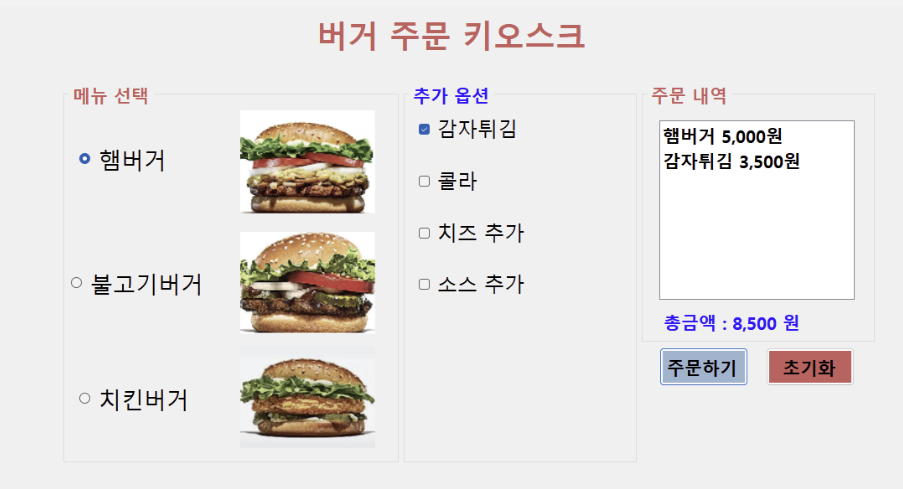
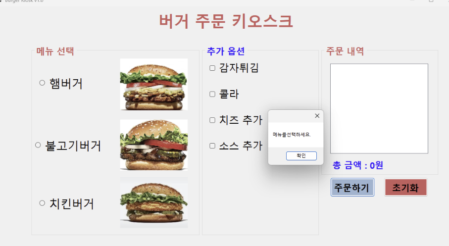
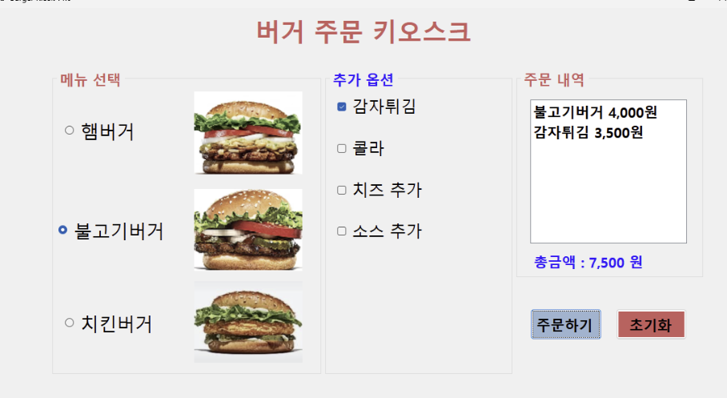
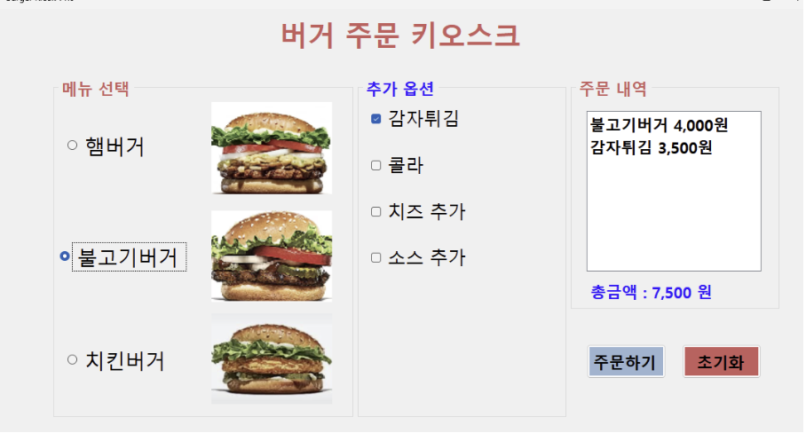
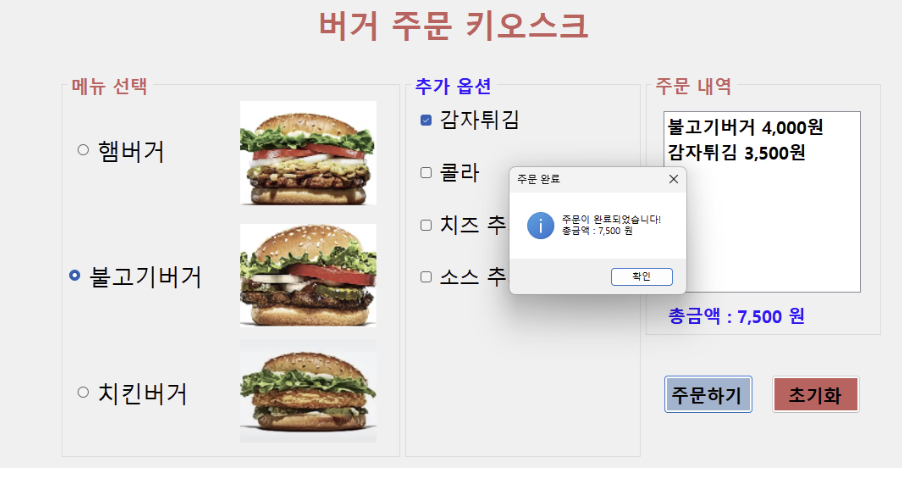

# BurgerKiosk

# (C# 코딩) 버거 키오스크
## 개요

- C# 프로그래밍학습

- 1줄소개: 사용자의 선택을 입력 받아 처리하는 프로그램

-사용한플랫폼: 
	- C#, .NET Windows Forms, Visual Studio, GitHub

-사용한컨트롤:
    - Label, ListBox,, Button, GroupBox, RadioButton, CheckBox

	
## 실행 화면

## 1단계 코드의 실행 스크린샷

기본 사용자 인터페이스(UI)를 체계적으로 배치하고 필요한 설정을 완료한 뒤, ‘주문하기’ 버튼과 ‘초기화’ 버튼이 원활하게 작동하도록 구현한다.
사용자는 마우스를 활용해 원하는 메뉴를 직관적으로 선택할 수 있으며, 선택한 항목을 ‘주문하기’ 버튼을 통해 손쉽게 처리할 수 있다.
또한 ‘초기화’ 버튼을 통해 현재 선택 상태를 간편하게 초기 상태로 되돌릴 수 있어, 전반적인 조작 과정이 편리하고 효율적으로 이루어지도록 설계한다.

## 2단계 코드의 실행 스크린샷

주문 가능한 메뉴가 하나도 선택되지 않은 경우에는, 사용자에게 상황을 명확히 안내하기 위해
‘메뉴가 선택되지 않았습니다’라는 오류 메시지를 화면에 표시하여 경고를 전달한다.

## 3단계 코드의 실행 스크린샷

Tab 키와 방향키를 활용하여 사용자가 메뉴 간을 자연스럽게 이동하며 원하는 항목을 선택할 수 있도록 구성하고, 
Enter 키와 스페이스바를 통해 선택한 메뉴를 주문할 수 있도록 기능을 구현한다.
이를 통해 마우스뿐만 아니라 키보드만으로도 모든 조작이 가능해지며,
접근성과 사용 편의성을 동시에 향상시켜 누구나 쉽고 효율적으로 시스템을 이용할 수 있도록 한다.

## 4단계 코드의 실행 스크린샷

사용자가 메뉴를 선택하는 즉시 해당 항목이 주문 내역에 자동으로 반영되도록 설정하여, 선택 과정만으로도 현재 주문 상태를 한눈에 확인할 수 있도록 한다.
이후 ‘주문하기’ 버튼을 누르면 주문이 정상적으로 접수되었음을 알리는 완료 메시지를 화면에 표시하여,
사용자가 주문이 성공적으로 처리되었음을 명확하게 인지할 수 있도록 구성한다.
